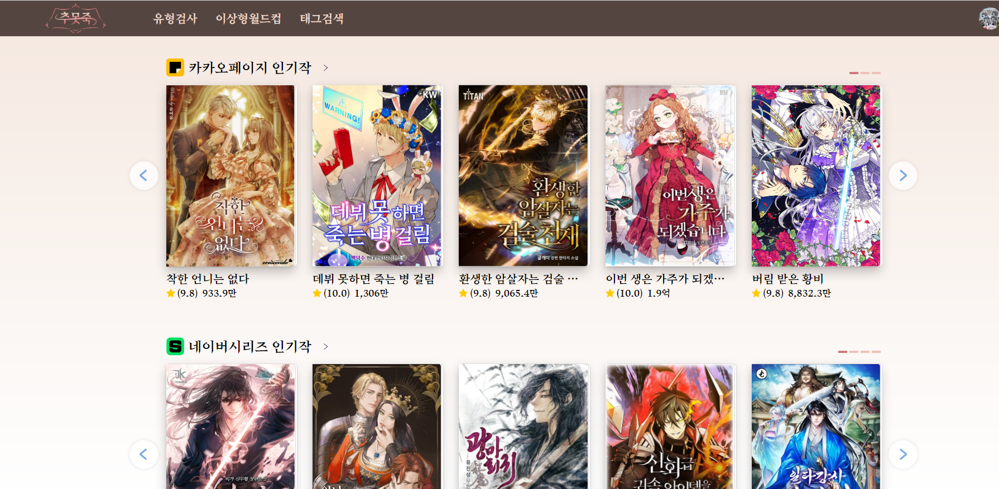
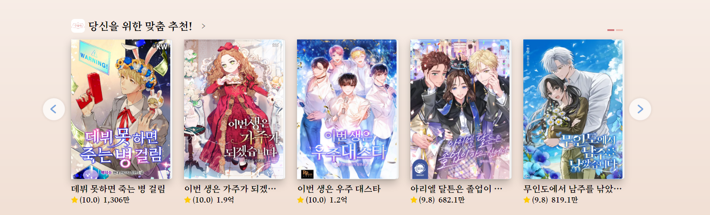
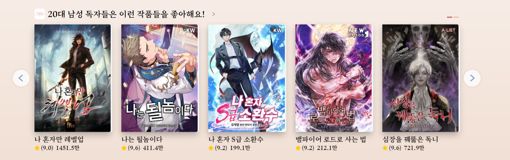
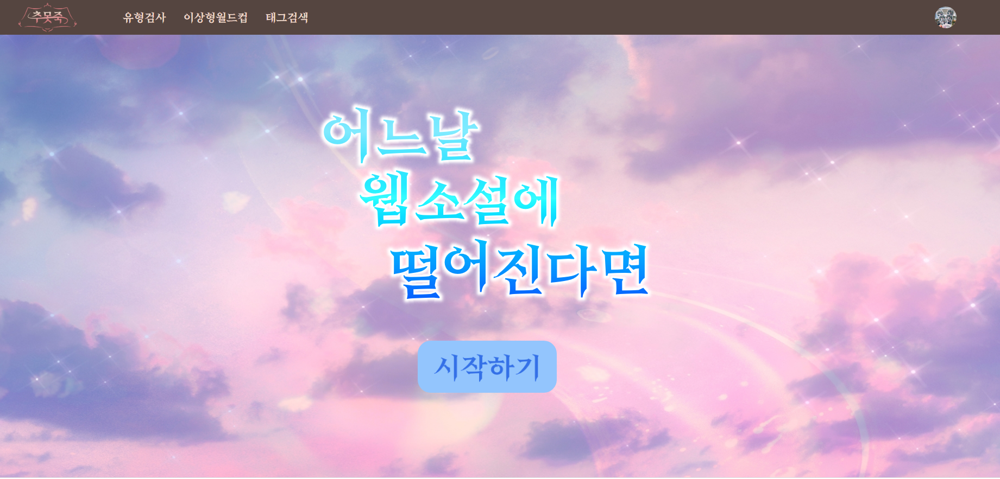
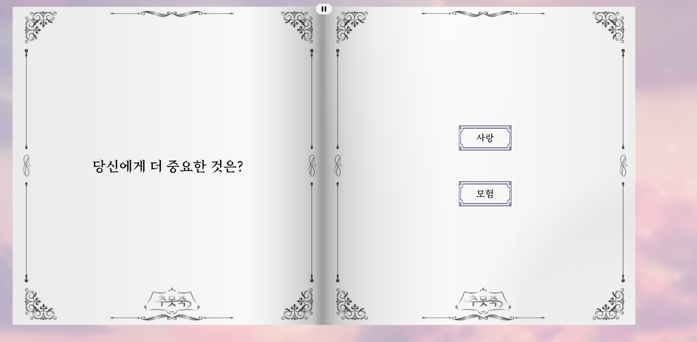
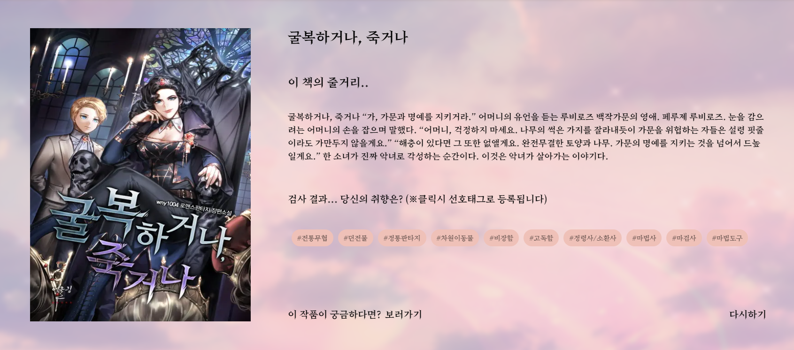
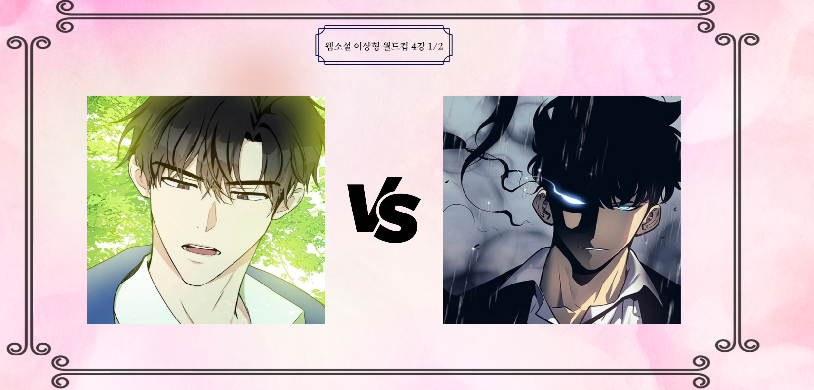
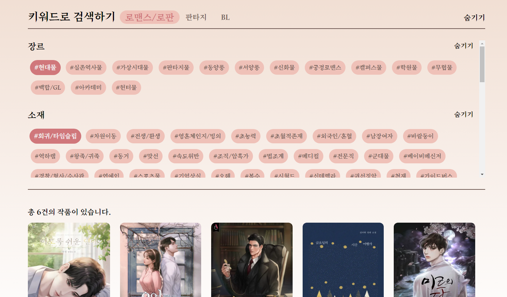

# 추못죽

## 🗓️프로젝트 개요

- **진행 기간 : 2022.08.29 ~ 2022.10.7 (7주)**
- **목표**
  - 빅데이터 분산 프로젝트로서, 하둡 에코시스템을 통한 웹소설 추천 서비스 입니다.
- **배포 링크**
  - https://j7a207.p.ssafy.io/

## 👯팀원 정보 및 업무 분담 내역

김동욱(팀장, BE) - UI 설계, UI 구현

전민재(FE) - UI 설계, UI 구현

최태순(BE) - ERD 설계, 데이터 전처리, 서버 개발

박예인(BE) - ERD 설계, 데이터 전처리, 서버 개발

김다은(Data,DevOps) - 웹 크롤링, 데이터 전처리, 하둡 에코시스템 구축 , CI/CD

이성민(Data,DevOps) - 웹 크롤링, 데이터 전처리, 하둡 에코시스템 구축

## :paperclip: 발표 자료

https://drive.google.com/file/d/1YYx4bnAN-2mFJwcSGTj6Wa0jTdxgIC25/view?usp=sharing

## :video_camera: 광고 영상

https://drive.google.com/file/d/1wD2AeuQnoK3OyLOt5QG4jfPolMGPY_jr/view?usp=sharing

### 메인 페이지

### 로그인 전 기본 추천

### 로그인 후 사용자 정보 기반 추천 (성별, 나이)

### 웹소설 취향 유형검사 시작화면

### 유형 검사 진행화면

### 유형 검사 결과화면

### 이상형 월드컵 시작화면

### 이상형 월드컵 진행화면

### 이상형 월드컵 결과화면

### 태그검색 페이지

## 기술 스택

1. Server: AWS EC2 Ubuntu 22.04.1 LTS
2. Visual Studio Code : 1.72.1
3. IntelliJ IDEA : 2022.1.4(Ultimate Edition) 11.0.15 + 10-b2043.56 amd64
4. Mysql: 8.0.28
5. JVM : 11.0.16+8-post-Ubuntu-Oubuntu120.04
6. Docker :20.10.18
7. NginX :1.23.1
8. Jenkins: 1.18.0-0ubuntu1.3
9. Node.js: 16.14.2
10. Vmware Workstation : 16.2.4
11. Hadoop : 3.2.2

## ERD

## 기능 정의서/API 명세서/테스트 시나리오

https://docs.google.com/spreadsheets/d/1hJ3F-pyaeCHFWGd1NqcsIKce6SUxkpg3S4VU9M1ses4/edit?usp=sharing

## 기획 자료(figma)

https://www.figma.com/file/xYiCDWV2GYnX3pQCz61hbz/%EC%BD%94%EC%9C%97%EB%AF%B8-%EA%B8%B0%ED%9A%8D-by-A304?node-id=0%3A1

